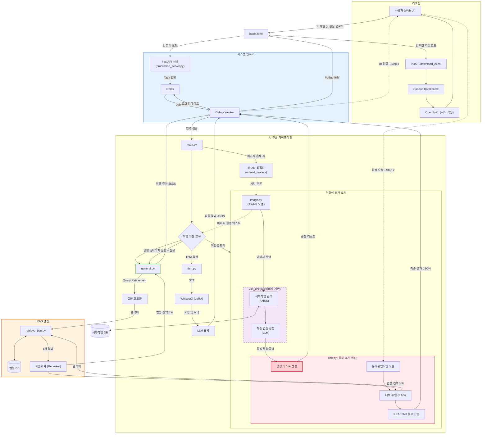

# 🏗️ 멀티모달 RAG 기반 지능형 산업안전보건 시스템 (Safety AI)

**산업안전보건법령 질의응답 및 KRAS 3x3 위험성평가 자동화 솔루션** 본 프로젝트는 산업 현장의 복잡한 법규와 안전 점검 절차를 AI를 통해 체계화하고, 현장 데이터(이미지, 음성)를 법령과 실시간으로 매칭하는 멀티모달 RAG 시스템입니다.

---

## 🌟 Key Highlights

- **지능형 RAG 파이프라인**: 1차 검색 후 쿼리 고도화(Query Refinement) 및 Reranking을 거치는 2단계 검색 엔진 구축
- **Human-in-the-loop 위험성평가**: AI가 생성한 공정 리스트를 사용자가 직접 검증/수정하는 인터랙티브 UI 기반 신뢰성 확보
- **멀티모달 통합**: VLM을 통한 현장 사진 분석 및 LoRA 파인튜닝된 WhisperX 기반 TBM(안전회의) 요약 기능
- **고성능 비동기 아키텍처**: FastAPI, Celery, Redis를 활용하여 고부하 AI 추론 중에도 멈추지 않는 서비스 구현

---

## 🚀 시스템 아키텍처 (System Architecture)

본 시스템은 단일 GPU 환경에서 멀티모달 모델의 효율적인 운용과 실시간 피드백을 위해 비동기 분산 처리 구조를 채택하였습니다.



## ✨ 핵심 기능 상세 (Core Features)

### 1. 지능형 법령 RAG
* **쿼리 분리 전략**: 검색을 위한 '기계용 질문(Refined Query)'과 답변을 위한 '사용자 질문'을 분리하여 검색 정확도 극대화.
* **하이브리드 검색**: 정규표현식 기반의 조문 직접 매칭과 임베딩 기반의 의미 검색을 결합.
* **2단계 재순위화**: FAISS로 추출된 후보군을 Cross-Encoder 기반의 Reranker로 재정렬하여 환각(Hallucination) 방지.

### 2. KRAS 3x3 위험성평가 자동화
* **KRAS 표준 매칭**: 사용자의 일상어를 산업안전보건공단(KRAS) 표준 업종 데이터와 벡터 매칭.
* **사용자 검증 루프**: AI가 생성한 공정 리스트를 사용자가 웹 UI에서 직접 수정/추가/삭제한 후 평가를 진행하는 신뢰 중심 설계.
* **정량적 스코어링**: 빈도(Likelihood)와 강도(Severity)를 LLM이 자동 산출하며, Batch Scoring 기법을 도입하여 처리 속도 300% 향상.

### 3. 멀티모달 현장 데이터 통합
* **VLM 시각 인지**: 현장 사진 속 장비와 작업 상황을 분석하여 위험성평가의 초기 컨텍스트로 자동 주입.
* **STT TBM 요약**: 현장 소음에 최적화된 LoRA 파인튜닝 WhisperX를 사용하여 안전 회의록을 자동 생성 및 요약.
* **VRAM 최적화**: VLM 추론 시 LLM/STT 모델을 동적으로 해제하는 모델 스와핑(Model Swapping) 기술 적용.

---

## 🛠️ 기술 스택 (Tech Stack)

### AI Models & Frameworks
* **LLM:** SKT A.X-4.0-Light (GGUF, Q5_K_M)
* **VLM:** SKT A.X-4.0-VL-Light (Hugging Face)
* **STT:** WhisperX (CTranslate2) + LoRA Fine-tuned
* **Embedding:** BGE-m3-ko
* **Reranker:** Ko-Reranker-v2
* **Framework:** llama-cpp-python, PyTorch, Transformers

### Backend & Infra
* **API Server:** FastAPI
* **Task Queue:** Celery
* **Message Broker:** Redis
* **Database:** FAISS (Vector DB), Pickle (Metadata)
* **Reporting:** Pandas, OpenPyXL (Excel Automation)

---

## 📂 프로젝트 구조 (Project Structure)

```text
├── production_server.py    # FastAPI & Celery 비동기 서버 메인
├── general.py              # 일반/법령 질문 처리 및 쿼리 고도화 로직
├── risk.py                 # 위험성평가 파이프라인 (Hazard, Measure, Scoring)
├── vlm_risk.py             # 이미지 기반 업종 매칭 및 VLM-Risk 연동
├── retrieve_bge.py         # 2단계 RAG 검색 엔진 (Vector Search & Rerank)
├── image.py                # VLM 추론 및 이미지 전처리 최적화
├── tbm.py                  # STT 기반 안전 회의록 요약 파이프라인
├── main.py                 # 모델 로드 및 입력 유효성 검증(LLM Guard)
└── index.html              # 사용자 검증 루프가 포함된 웹 인터페이스
